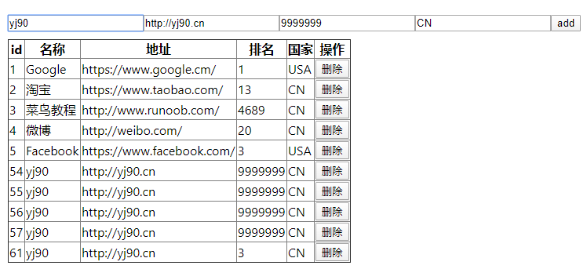

<!--
 * @Author: yangj
 * @Date: 2020-03-18 16:06:18
 * @LastEditors: yangj
 -->
### 简介
一个简单的接口请求，是我的另一个node后端demo项目的接口请求demo
[后端node代码](https://github.com/YoungHearts/node_api "后端node代码")
### 运行
npm install

npm start
### 截图
